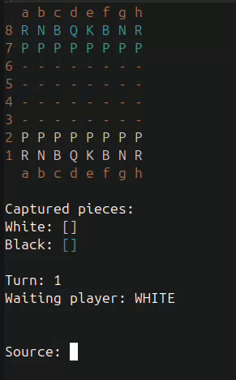

# Chess System - Java ♟️

This is a complete chess game system that runs in the terminal, developed in **Java**. The project applies advanced **Object-Oriented Programming (OOP)** concepts, such as inheritance, polymorphism, encapsulation, and exception handling.

Originally based on the course by Professor **Nélio Alves**, this repository contains authorial modifications focused on **Clean Code** and movement algorithm optimization.

---

## 🔨 My Contributions (Refactor)

Unlike the standard structure, I implemented improvements to make the code more readable and efficient:

* **Logic Unification (`canMoveTo`):** I created a centralized method to validate destinations, eliminating the need to repeat "empty square" vs. "enemy capture" checks in separate blocks.
* **Optimized Flow Control:** I used `break` statements in long-range movement loops (Rook, Bishop, and Queen), significantly reducing code verbosity.
* **Maintainability:** The new structure allows new movement rules to be added with far fewer lines of code, respecting the **DRY (Don't Repeat Yourself)** principle.

---

## 🛠️ Technologies and Concepts

- **Language:** Java (JDK 11+)
- **IDE:** IntelliJ IDEA
- **Environment:** Linux (Ubuntu/Debian)
- **OOP Concepts applied:**
  - Inheritance and Polymorphism (Pieces inheriting from `ChessPiece`)
  - Encapsulation (Access modifiers and Layer Separation)

---

## 🎮 Gameplay Demonstration

To showcase the system's logic and move validation, here is a full match demonstrating the **Légal's Mate** (a classic chess trap involving a Queen sacrifice).

---

## 🎮 How to Run

### Prerequisites
* Java JDK 11 or higher installed.
* Git to clone the repository.

### Step-by-Step
1. Clone the repository:

 git clone [https://github.com/ArthBMC/chess-system-java.git](https://github.com/ArthBMC/chess-system-java.git)

2. Navigate to the project folder:

  cd chess-system-java/src

3. Compile the Program.java using:

  javac application/Program.java

4. Run the application (using your IDE or terminal):

#### Example via terminal (depending on your folder structure)
   
   java application/Program
